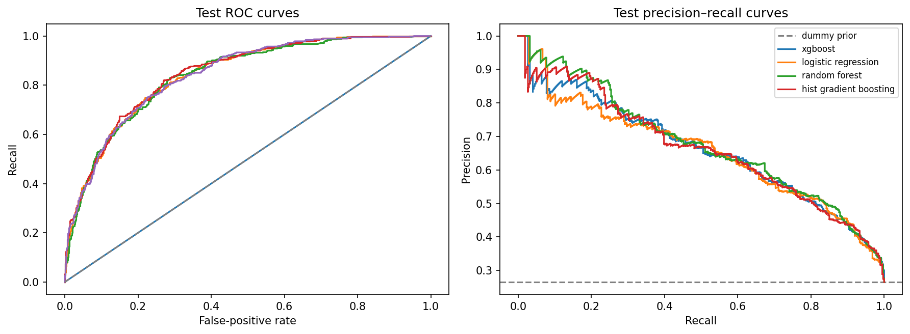

# Customer Churn: Prediction and Retention Review

A reproducible churn case study that connects model evaluation to a practical question: **which customer profiles should a retention team review when capacity is limited?**

The project includes a validated raw-data pipeline, model comparisons, a validation-selected review cutoff, an executed notebook, a local scoring dashboard, and auditable prediction files. It uses the supplied IBM Telco sample as an educational benchmark. It is not a deployed commercial system or evidence of prevented churn.



## Results you can verify

The reproduced run selects **logistic regression** using five-fold training average precision. On the 1,409-row test partition, the validation-selected policy identifies **302 of 374 churners**, flags **287 non-churners**, and misses **72 churners**. This means reviewing **589 profiles**, with **80.7% recall** and **51.3% precision**.

Test ROC-AUC is **0.8402**, average precision is **0.6563**, and F1 at the review cutoff is **0.6272**. These are a snapshot of the included run, not guaranteed performance on other data. The generated [results report](reports/RESULTS.md) contains the comparison table, uncertainty intervals, threshold trade-offs, feature interpretation, and subgroup checks. Rerunning on other data regenerates that report; update this README snapshot if the inputs or settings change.

**Evidence:** [executed notebook](notebooks/churn_eda_modeling.ipynb) · [test predictions](reports/test_predictions.csv) · [run manifest](reports/run_manifest.json) · [test log](reports/tests.log).

## Why this version is more defensible

- **Model selection:** five-fold training average precision selects the candidate; test metrics never choose the winner.
- **Decision policy:** a separate validation set chooses the highest cutoff reaching 80% recall, an explicitly illustrative objective.
- **One pipeline:** input validation, cleaning, feature engineering, imputation, scaling, encoding, and the model are shared by training and inference.
- **Honest interpretation:** observed associations are separated from causes, and ranking lift is separated from campaign savings.
- **Reproducible outputs:** saved source-row IDs and predictions allow independent metric recomputation. The data, source files, versions, and hyperparameters are fingerprinted.
- **Measured engineering:** 14 automated checks cover split separation, missing data, input errors, threshold policy, serialization, scoring consistency, and HTTP endpoints.

See [the implementation review](reports/REVIEW.md) for the issues found in the original archive and how they were addressed.

## Run locally

Tested with **Python 3.12.14**. Run commands from the project root after extracting the archive:

```bash
python3 -m venv .venv
source .venv/bin/activate
python -m pip install -r requirements.txt
python -m src.train
python -m unittest discover -s tests -v
python -m app.app
```

Open **http://127.0.0.1:8501**. The app is a lightweight local HTTP dashboard, replacing the original duplicated Streamlit setup. It uses the freshly trained root-level artifact. It is intended for a local demo, not as a public production server. Stop it with Ctrl+C.

The included model was generated in the recorded environment. For another package version or platform, retrain before using it. Only load model files you generated or trust; model persistence uses joblib.

### Dashboard

- **Overview:** selected model, measured scores, and review workload.
- **Customer score:** explicit billing history and consistent service choices.
- **Batch scoring:** upload a CSV, retain customer IDs and row order, and download scores and review flags.
- **Evaluation:** CV comparison, holdout curves, confusion matrix, and calibration diagnostic.
- **Insights & limits:** permutation importance, training-only associations, and evidence limits.

For a demo, use [sample_customers.csv](data/sample_customers.csv), which contains ten training profiles without labels. The app accepts at most 5,000 rows per upload. It does not persist uploaded customer records.

### Command-line batch prediction

```bash
python -m src.predict --input data/sample_customers.csv --output data/processed/churn_scores.csv
```

The output preserves input columns and adds `churn_score` and `flagged_for_review`. The flag uses the saved validation cutoff, not a separately invented high/medium/low tier.

### Re-execute the notebook

```bash
python -m pip install -r requirements-notebook.txt
python scripts/run_notebook.py
```

This executes every code cell in order using in-process IPython, captures real printed and rich display outputs, and aborts on errors. It was used for the delivered notebook because the execution environment could not start a separate Jupyter kernel. The notebook can also be opened in Jupyter or VS Code; its code uses normal Python cells. Its training cell reruns training and refreshes artifacts.

## Evaluation design

| Partition | Rows | Purpose |
| --- | ---: | --- |
| Training | 4,225 | Five-fold candidate selection and final estimator fit |
| Validation | 1,409 | Review cutoff selection |
| Test | 1,409 | Evaluation after model and cutoff are locked |

Seed: **2026**. All splits are stratified and disjoint by customer. Candidates are a prior-only dummy, logistic regression, random forest, XGBoost, and histogram gradient boosting. Settings are fixed rather than extensively tuned. Models use the observed class distribution; positive-class AP and threshold selection address the review objective without oversampling or class weighting.

The model exported for scoring is fitted on the training partition only. It is not refitted on the holdout after reporting results. `AvgMonthlySpend` is checked in a separate, paired CV ablation rather than assumed to improve performance.

**Important limitation:** the original project already examined this public dataset. The revised split protects the current workflow, but it is not new independent external evidence. No date-based split is possible from the supplied fields; availability of inputs before future churn remains unverified.

## Data and input contract

The supplied CSV has **7,043 rows and 21 columns**: 19 predictors, `customerID`, and `Churn`. There are 1,869 positive labels and 11 blank `TotalCharges` values. The identifier is excluded from modelling.

- Numeric inputs: `tenure`, `MonthlyCharges`, `TotalCharges`.
- Categorical inputs and allowed values: [`src/preprocessing.py`](src/preprocessing.py).
- Target: `Churn` as `Yes`/`No` or `1`/`0`, required only for training.
- Missing numeric values use training medians; categorical blanks use training modes. Missing columns, invalid categories, negative/nonfinite amounts, fractional tenure, and contradictory service selections are rejected.
- Blank cumulative bills at zero tenure become zero. Other unknown totals are not invented from current monthly charges.

See [data provenance](data/README.md) for the source, checksum, and scope. The original CSV is retained unchanged.

## Project layout

| Path | Role |
| --- | --- |
| `src/preprocessing.py` | Validation and shared sklearn pipeline construction |
| `src/train.py` | Splits, CV, selection, evaluation, figures, persistence |
| `src/evaluation.py` | Metrics, validation cutoff, bootstrap intervals, capacity scenario |
| `src/predict.py` | Raw-profile batch inference and CLI |
| `src/reporting.py` | Results explanations generated from computed outputs |
| `app/app.py`, `app/static/index.html` | Local dashboard and scoring endpoints |
| `notebooks/churn_eda_modeling.ipynb` | Executed analysis and verification walkthrough |
| `scripts/run_notebook.py` | Reproducible notebook execution |
| `tests/test_project.py` | Data, model, and HTTP regression checks |
| `models/` | Freshly generated pipeline and metrics |
| `reports/` | Results, review, predictions, provenance, logs, and figures |

## Scope and next steps

The strongest next step is better validation, not more algorithms: define a future churn horizon, verify feature timing, obtain later customer data, check calibration and subgroup errors, and run a controlled outreach pilot. No commercial ROI, causal retention effect, fairness certification, model monitoring service, or public deployment is claimed.

The original SHAP analysis is replaced with directly regenerated **permutation importance**. It measures global predictive reliance, not per-customer causes. Correlated or mechanically related billing features require cautious interpretation.
