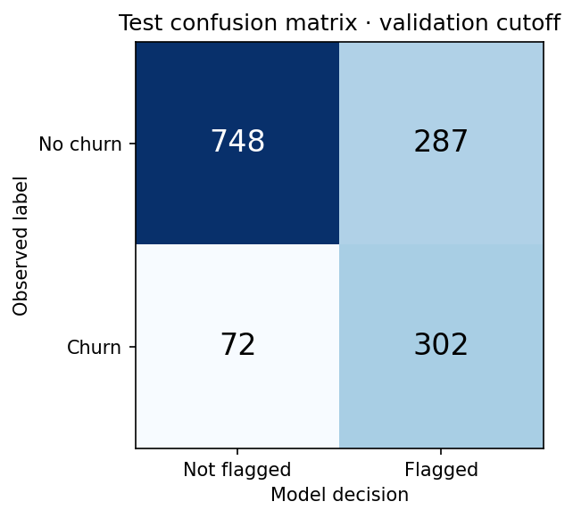
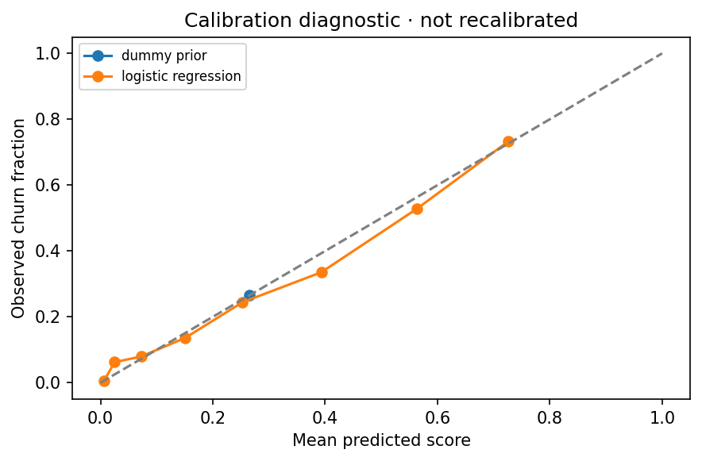
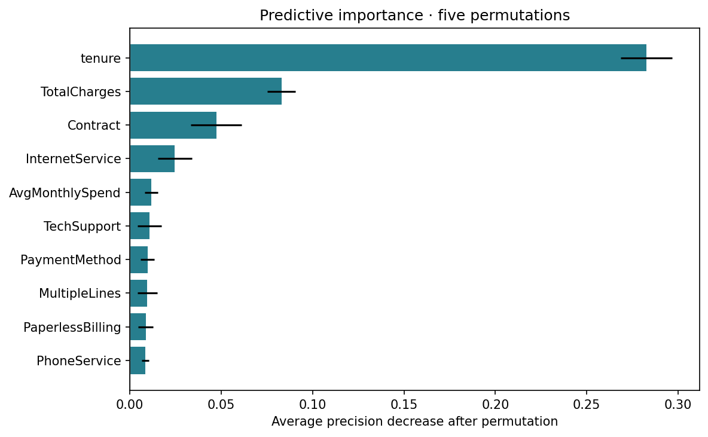
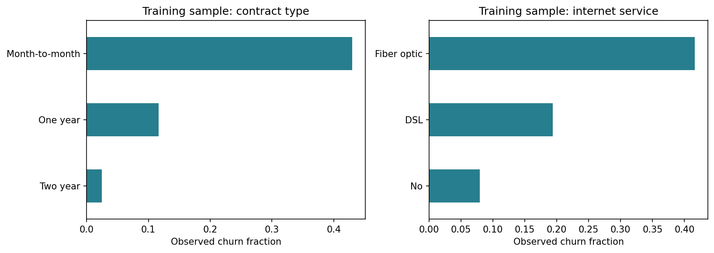

# Churn case study: executed results and interpretation

Author: Clifton Brown Ommila · Run: 2026-09-15T08:20:21.642052+00:00 · Python 3.12.14

## What was actually executed?

The pipeline was fitted from the supplied CSV. Five candidates were evaluated with five-fold stratified training cross-validation, producing 25 validation scores. A separate five-fold logistic-regression ablation tested the engineered spending ratio. Every table here is generated from saved metrics and predictions. No original serialized model or original result image was reused.

The dataset contains **7,043 customer records**, 21 columns (19 raw predictors, one ID, and the target), and **1,869 churn labels (26.54%)**. This is the sample's prevalence, not an annual telecom industry churn rate. There are no duplicate customer IDs and 11 blank cumulative bills. The blanks at zero tenure become zero; other numeric missing values use medians learned inside each training fold.

## Evaluation design

- Training: 4,225 rows. All candidates use identical five-fold stratified splits; each fold learns its own imputers, scaler, and encoder.
- Validation: 1,409 rows. Used only to choose the review cutoff for the selected model.
- Test: 1,409 rows, including 374 churners. Used after model and cutoff choices are locked.
- Fixed split seed: 2026. IDs and target are excluded from features. There is no resampling or class reweighting.
- Candidate hyperparameters are fixed, not a large search. The selection criterion is average precision (AP), chosen because positive-class ranking matters under imbalance.

The original project already inspected this public dataset and an earlier test split. The new split enforces separation inside this implementation but does **not** make this an unseen external benchmark. There is no timestamped evaluation, prospective campaign, or independent customer population.

## Model comparison

| Model | Training CV AP | Fold SD | Test ROC-AUC | Test AP | Test F1 at 0.5 |
| --- | --- | --- | --- | --- | --- |
| logistic_regression | 0.6570 | 0.0285 | 0.8402 | 0.6563 | 0.6006 |
| hist_gradient_boosting | 0.6558 | 0.0262 | 0.8418 | 0.6649 | 0.5954 |
| random_forest | 0.6532 | 0.0281 | 0.8474 | 0.6790 | 0.5807 |
| xgboost | 0.6479 | 0.0255 | 0.8431 | 0.6626 | 0.5869 |
| dummy_prior | 0.2653 | 0.0005 | 0.5000 | 0.2654 | 0.0000 |

**Selected: `logistic_regression`**, using the largest mean training CV AP. The test scores do not change this choice. The models are close in CV and the fold standard deviations overlap; that is not a formal significance test or evidence of a decisive winner. A simple model can be a defensible portfolio result.

The prior-only baseline gives every profile the training prevalence. Its ROC-AUC is 0.5 and its test AP is approximately test prevalence. High majority-class accuracy alone would not identify churners.

## What do the selected model's scores mean?

- **ROC-AUC 0.8402**, 95% bootstrap interval **0.8183–0.8609**: the model generally ranks an observed churner above a non-churner. This is not the percentage of customers classified correctly.
- **Average precision 0.6563**, interval **0.6073–0.7049**: precision summarised over recall levels. This is not precision at the operational cutoff, and it is not trapezoidal PR-AUC.
- **Brier score 0.1373**, versus **0.1950** for the prior baseline: average squared error of probability estimates, where lower is better. Better Brier score alone does not prove good calibration; inspect the calibration plot.
- Scores are **not recalibrated**. No claim is made that a score of 0.8 guarantees an 80% churn frequency in a different population.

Intervals use 500 bootstrap resamples of test rows at a fixed fitted model and cutoff. They omit retraining uncertainty, threshold-selection uncertainty, and future distribution shift.

## Decision threshold and workload

Illustrative objective: find the **highest validation cutoff reaching at least 80% recall**. Because higher cutoffs produce nested smaller flagged sets, this minimises contact volume subject to that validation target. It is not a revenue-optimised threshold.

The chosen cutoff is **0.272015**. Validation recall is 80.2%; test recall is 80.7%. Meeting the validation target does not guarantee meeting it elsewhere.

| Policy | Flagged | True positives | False positives | Missed churners | Precision | Recall |
| --- | --- | --- | --- | --- | --- | --- |
| Default 0.5 | 332 | 212 | 120 | 162 | 63.9% | 56.7% |
| Validation cutoff 0.2720 | 589 | 302 | 287 | 72 | 51.3% | 80.7% |
| Top 20% capacity | 282 | 193 | 89 | 181 | 68.4% | 51.6% |

At the validation cutoff, **302 of 374 observed churners are flagged** and **72 are missed**. However, **287 flagged profiles did not churn**. The team would review **589 of 1,409 profiles (41.8%)**, with 51.3% precision. That is the practical workload behind the recall score.

If capacity is limited to the top 20% instead, reviewing 282 profiles captures 193 churners (51.6% recall), with 68.4% precision and **2.58×** the random-selection positive rate. This is a ranking diagnostic, not an estimate of prevented churn or savings. The top-20% policy was pre-specified for comparison; it does not change the deployed cutoff.

## Feature engineering: was the spending ratio useful?

With `AvgMonthlySpend`, logistic regression CV AP is 0.6570; without it, 0.6576. The mean paired fold difference is **-0.0007**. This small, dataset-specific comparison does not establish a reliable improvement. The feature is retained as a documented experiment; no large performance benefit is claimed. Its incremental value may be limited because it overlaps with existing billing fields.

## Explaining model reliance

| Feature | Mean AP decrease | Shuffle SD |
| --- | --- | --- |
| tenure | 0.2828 | 0.0141 |
| TotalCharges | 0.0829 | 0.0077 |
| Contract | 0.0472 | 0.0138 |
| InternetService | 0.0246 | 0.0093 |
| AvgMonthlySpend | 0.0117 | 0.0037 |
| TechSupport | 0.0108 | 0.0065 |

These are **permutation importance** results for the selected model on the test rows, using AP and five shuffles. They measure predictive reliance, not causal effects or per-customer reasons. Error bars are shuffle standard deviations. Importance was computed after stateless cleaning so the engineered ratio is an independently permuted column; its dependence on cumulative charges and tenure can make these combinations unrealistic. Correlated predictors can share or mask importance.

The original SHAP section was replaced with this directly reproducible analysis. No SHAP-derived claim is made. Training-only contract and internet-service summaries are saved separately so descriptive segment associations can be checked.

## Subgroup error check

| Group | Value | Test rows | Observed churners | Recall | Precision | False-positive rate |
| --- | --- | --- | --- | --- | --- | --- |
| gender | Female | 672 | 189 | 82.5% | 53.4% | 28.2% |
| gender | Male | 737 | 185 | 78.9% | 49.2% | 27.4% |
| SeniorCitizen | 0 | 1172 | 277 | 77.3% | 50.2% | 23.7% |
| SeniorCitizen | 1 | 237 | 97 | 90.7% | 54.0% | 53.6% |

These are descriptive test-set error rates, without subgroup uncertainty intervals or a causal adjustment. Smaller groups can have unstable estimates. This is an initial audit, not fairness certification. Demographic predictors remain in the benchmark model; operational inclusion would require a purpose-specific review and a validated comparison with a model excluding them.

## Realistic next steps

1. Define the prediction date and future churn horizon; verify that every billing and contract field exists at scoring time. This snapshot cannot establish that temporal condition.
2. Validate on later customers from the actual service, including calibration and subgroup errors.
3. Agree on review capacity, contact cost, and expected response rates before choosing a commercial threshold.
4. Test outreach in a randomised pilot against a control group. Associations with contracts or add-ons do not prove those changes prevent churn.
5. Monitor data quality, score distributions, outcomes, and service performance before any production deployment.

## Reproduction evidence

- Dataset SHA-256: `16320c9c1ec72448db59aa0a26a0b95401046bef5d02fd3aeb906448e3055e91`.
- [`run_manifest.json`](run_manifest.json): exact package versions, hyperparameters, seed, runtime, and training-source hashes.
- [`test_predictions.csv`](test_predictions.csv) and [`validation_predictions.csv`](validation_predictions.csv): source row, customer ID, true label, score, and flag.
- [`splits.csv`](splits.csv) and [`cv_folds.csv`](cv_folds.csv): split membership and individual CV scores.
- [`training.log`](training.log), [`tests.log`](tests.log), and the executed notebook provide execution evidence.
- The exported pipeline is fitted on training rows only, not refitted on validation or test rows after evaluation.

## Sources and scope

The original archive identifies the [IBM Telco example repository](https://github.com/IBM/telco-customer-churn-on-icp4d) as its source. IBM describes its Telco sample as a [fictional company dataset](https://www.ibm.com/docs/en/cognos-analytics/12.1.x?topic=samples-telco-customer-churn). Genuine execution here means genuine calculations on the supplied sample, not verified commercial customer outcomes. The supplied file is retained unchanged and fingerprinted; its upstream download history is not independently attested.

Metric definitions follow [scikit-learn's evaluation documentation](https://scikit-learn.org/stable/modules/model_evaluation.html); calibration cautions follow its [calibration guide](https://scikit-learn.org/stable/modules/calibration.html).
